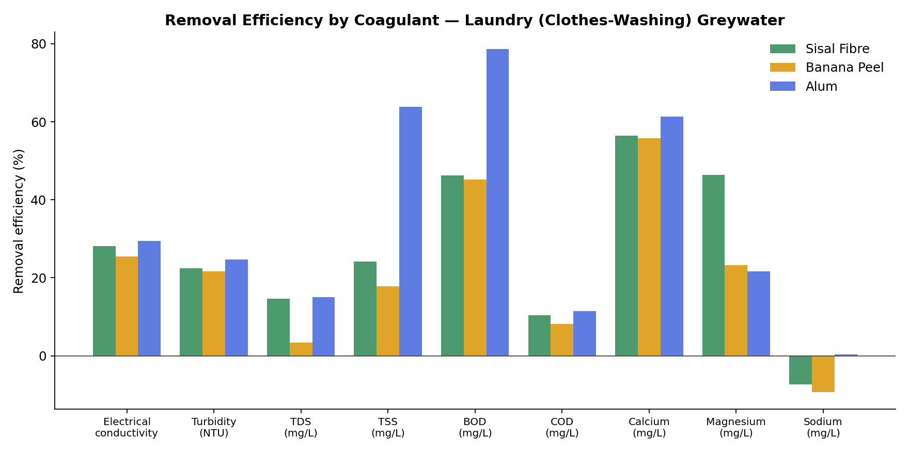
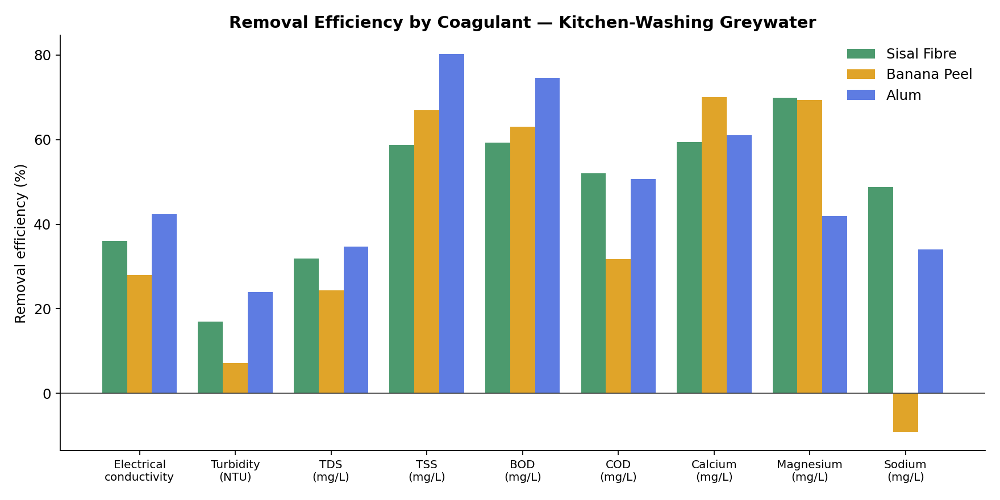
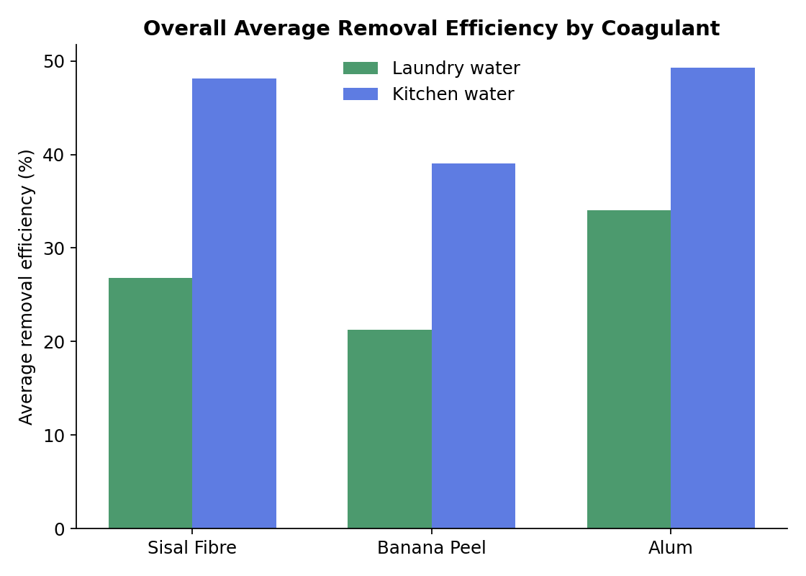

# 🌿 PeelPower: Sisal Fibre & Banana Peel as Green Coagulants for Greywater Treatment

**Can farm and kitchen waste out-clean a chemical coagulant?** This project benchmarks two low-cost, biodegradable natural coagulants — **sisal fibre** and **banana peel** — against **alum**, the conventional chemical coagulant, for treating household greywater (laundry and kitchen washing water).

A Civil Engineering B.Sc. project (University of Jos), covering coagulation-flocculation trials, physicochemical analysis (pH, EC, turbidity, TDS, TSS, BOD, COD, Ca, Mg, Na), one-way ANOVA with Tukey HSD post-hoc tests, Pearson correlation analysis, and a comparison against FAO (Ayers & Westcot, 1985) irrigation water quality guidelines.

---

## 🔑 Key Findings

| | Laundry water (avg. RE%) | Kitchen water (avg. RE%) |
|---|---|---|
| **Sisal Fibre** | 26.8% | 48.1% |
| **Banana Peel** | 21.3% | 39.1% |
| **Alum** | 34.0% | 49.3% |

- **Alum still edges out both natural coagulants overall**, but **sisal fibre came remarkably close to alum on kitchen greywater** (48.1% vs 49.3% average removal efficiency) — a strong result for an untreated, biodegradable agricultural fibre.
- Sisal fibre outperformed alum on **magnesium removal in laundry water** (46.4% vs 21.7%) and was competitive on calcium across both water types.
- Statistically significant differences (one-way ANOVA, p < 0.05) between coagulants were found for **electrical conductivity, TDS, calcium, and sodium** in laundry water, and for **pH, temperature, electrical conductivity, and turbidity** in kitchen water.
- Both natural coagulants brought pH down from an alkaline ~8–9.3 (control) into the neutral 6–6.2 range — comparable to alum.
- All treated samples fell into the **"Safe" SAR (sodium adsorption ratio) category** for irrigation reuse, per FAO guidelines, though EC remained in the "Severe restriction" band for all samples, including alum.

Full breakdown, statistics, and interpretation: see **[REPORT.md](REPORT.md)**.

---

## 📊 Charts

| | |
|---|---|
|  |  |



---

## 📁 Repository Structure

```
├── README.md                 # You are here
├── REPORT.md                 # Full analysis report (methodology, results, discussion)
├── LICENSE
├── figures/                  # Generated comparison charts (PNG)
│   ├── re_cloth.png
│   ├── re_kitchen.png
│   └── re_overall_average.png
├── data/
│   ├── raw/                  # Original triplicate lab readings per coagulant + control
│   │   ├── Waste_water_Result.xlsx
│   │   └── *.csv             # same data, one CSV per sheet
│   └── processed/            # Summary stats, ANOVA/Tukey, correlation, FAO comparison
│       ├── Analytical_Results_and_Statistics.xlsx
│       └── *.csv             # same data, one CSV per sheet
└── scripts/
    └── make_charts.py        # Regenerates the figures/ charts from the summary data
```

## 🧪 Method Summary

Greywater samples were collected from two domestic sources — **clothes-washing** and **kitchen-washing** water — and treated in triplicate with three coagulants: **sisal fibre**, **banana peel**, and **alum** (control), following standard jar-test coagulation-flocculation procedure. Eleven physicochemical parameters were measured per sample. Results are reported as **mean ± SD of three replicate runs**, with **removal efficiency (RE%)** calculated relative to the untreated control. Group differences were tested with **one-way ANOVA**, followed by **Tukey HSD** post-hoc comparisons where significant. **Pearson correlation** was run between related parameter pairs (e.g. TDS vs EC, BOD vs COD). Treated water quality was benchmarked against **FAO (Ayers & Westcot, 1985)** irrigation water guidelines for EC, TDS, and SAR.

## 🔁 Reproducing the Charts

```bash
pip install pandas matplotlib openpyxl
python scripts/make_charts.py
```

## 📄 License

Data and report are shared under the [MIT License](LICENSE) — feel free to reuse with attribution.

---

*Part of an undergraduate Civil Engineering research project, University of Jos.*
